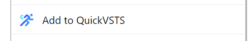

# Quick VSTS

Chrome extension giving quick access to VSTS features

Supports rendering of:
* Dashboards in responsive mode
* Kanban boards in chrome-less mode
* Work Item Queries in chrome-less mode

# Using Extension
## Adding an item
To add one of the supported items to the quick list, visit the corresponding page and right click anywhere on the page. Then click "Add to QuickVSTS":

## Deleting an item
Hover over item in quick list and click delete button.

(c) Artem Saveliev 2018

Icons made by <a href="http://www.freepik.com" title="Freepik">Freepik</a> from <a href="https://www.flaticon.com/" title="Flaticon">www.flaticon.com</a> is licensed by <a href="http://creativecommons.org/licenses/by/3.0/" title="Creative Commons BY 3.0" target="_blank">CC 3.0 BY</a>